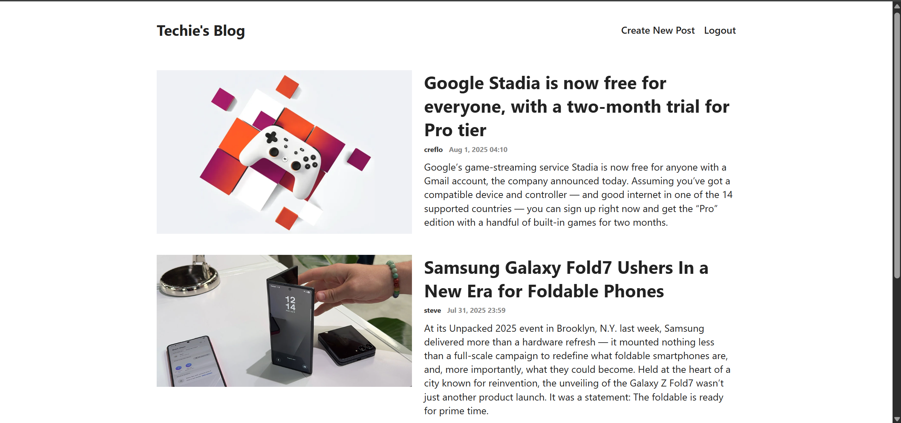
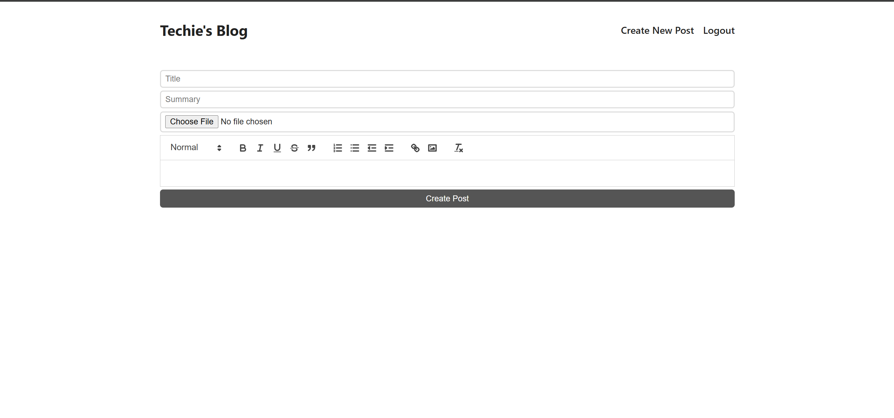
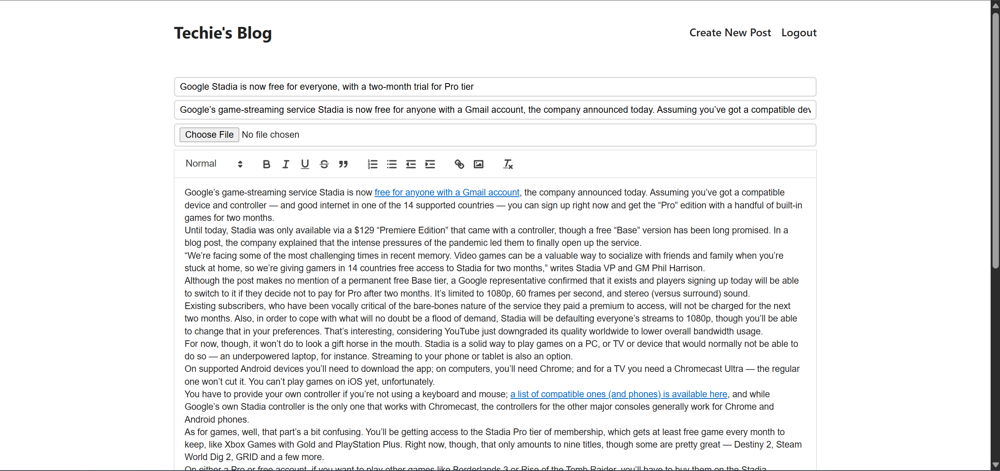
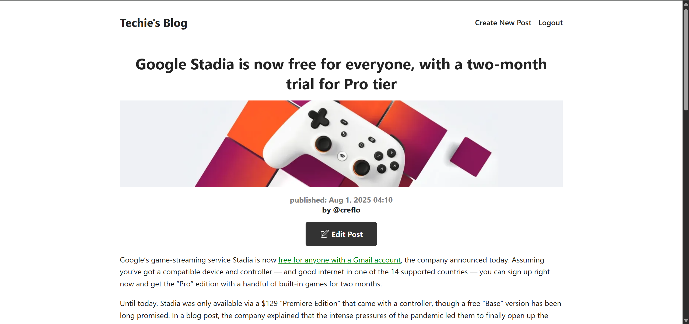
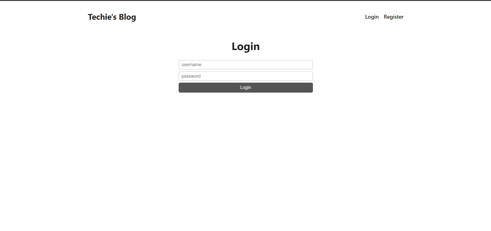
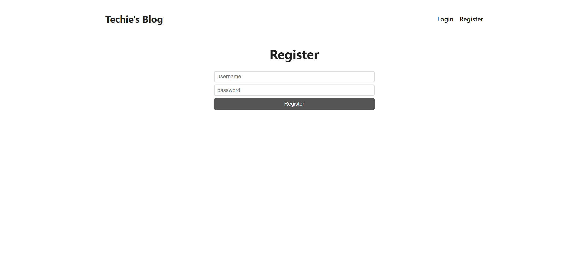
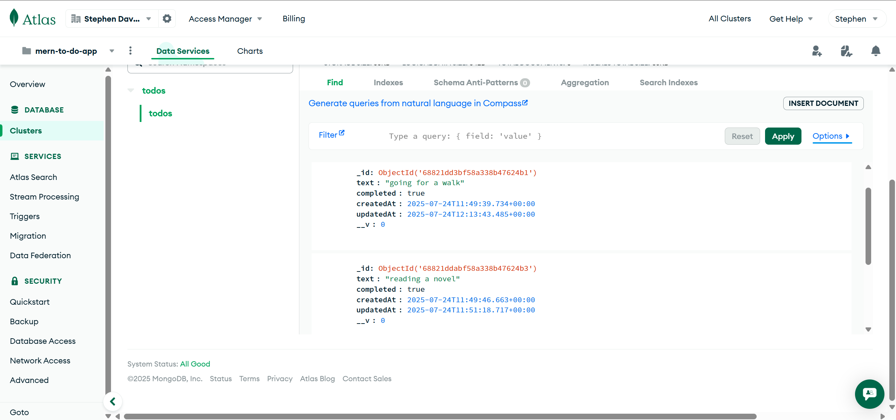
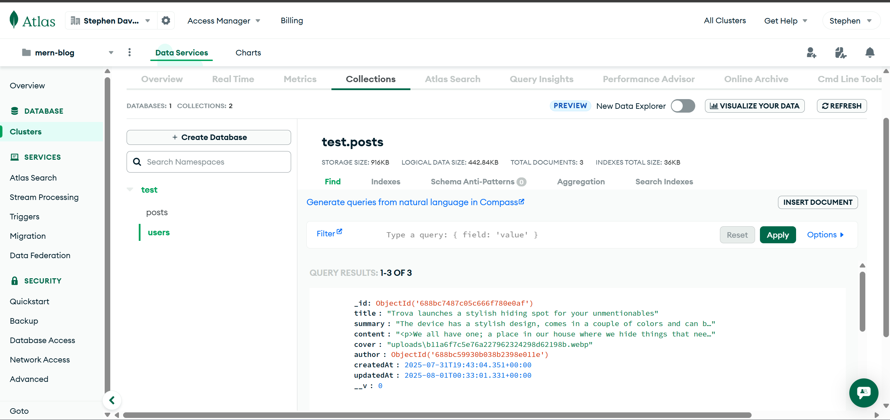
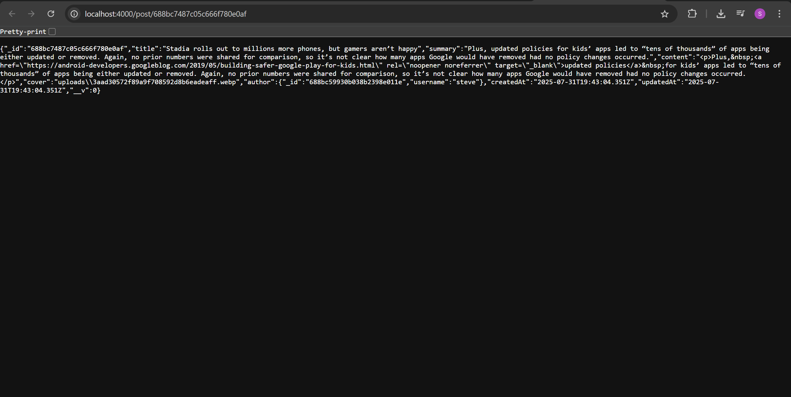

# 🧠 Techie's Blog App – A Full-Stack Blogging Platform for Developers and Tech Enthusiasts

**Techie’s Blog App** is a modern, full-featured blog application specifically crafted for developers and technology enthusiasts who want to share knowledge, publish tutorials, write tech articles, and engage with a like-minded audience. Built on the powerful **MERN (MongoDB, Express.js, React, Node.js)** stack, this platform allows users to sign up, log in securely, and manage blog content with ease using a rich text editor and media uploads.

With a simple yet elegant interface, the application provides seamless navigation between pages, secure user sessions, and dynamic content rendering. Whether you're posting about JavaScript, machine learning, cloud architecture, or the latest trends in software engineering—Techie's Blog App offers a clean, productive space for your thoughts to thrive.

---

## 🎥 Video Demo

[🔗 Watch the walkthrough](https://drive.google.com/file/d/1hs2fOgVD21N10x8-WyU5INN4sN5Efkzz/view?usp=drive_link)

---

## 📊 Pitch Deck

[🔗 View the pitch deck](https://docs.google.com/presentation/d/16h9wllOY6nDys0EtII1jgS4IWpflSaBD/edit?usp=sharing&ouid=112151649881665385479&rtpof=true&sd=true)

---


## 🚀 Features at a Glance

- 🔐 **User Authentication**: Users can register and log in using secure password encryption and token-based authentication (JWT). Authenticated users remain logged in across sessions using HTTP-only cookies.
  
- 📝 **Create & Edit Posts**: Authenticated users can create rich blog posts with formatted text, headers, code snippets, block quotes, and more—thanks to the integrated rich-text editor.

- 🖼️ **Image Uploads**: Posts can include a custom cover image, uploaded by the user and stored on the server using Multer middleware.

- 📖 **Post Management**: Users can edit or update their existing posts. The UI reflects permission-based access for edit functionality.

- 🧑‍💼 **User-Specific Content**: Each post is associated with an author, and only the author can edit their content. 

- 🗂️ **Recent Posts Listing**: Posts are sorted by creation date and limited for optimized performance, giving users a look at the latest content first.

- 💻 **Developer-Centric Design**: Built specifically for tech topics, the editor and layout support writing about code, concepts, and tutorials effectively.

---

## 🛠️ Technology Stack and Key Libraries

### 🔧 Frontend – React Ecosystem

- **React.js**: A component-based JavaScript library used to create a dynamic, SPA (Single Page Application) UI that reacts instantly to user interactions.

- **React Router DOM**: Enables routing within the React app, allowing seamless transitions between views like login, registration, post creation, and blog viewing without page reloads.

- **React Quill**: A powerful WYSIWYG editor that brings rich text editing capabilities into the browser. Users can write articles with markdown-style formatting, code blocks, lists, and headings.

- **CSS**: Custom, responsive CSS styles were written to create an intuitive and mobile-friendly UI layout.

### 🖥️ Backend – Node.js & Express

- **Node.js**: JavaScript runtime environment powering the backend server.

- **Express.js**: Lightweight web framework used to define RESTful API routes for authentication, post creation, and data retrieval.

- **Multer**: Middleware for handling `multipart/form-data`, especially file uploads. Used for handling user-submitted images.

- **Cookie-Parser**: Parses and manages HTTP cookies to maintain user sessions securely.

- **jsonwebtoken (JWT)**: Implements secure authentication using tokens, enabling the server to verify user identity and protect private routes.

- **bcryptjs**: Used to hash and verify user passwords, ensuring secure storage and authentication.

### 📦 Database – MongoDB & Mongoose

- **MongoDB Atlas**: A cloud-based NoSQL database where user profiles and blog posts are stored and queried efficiently.

- **Mongoose**: ODM (Object Data Modeling) library that provides schemas and validation for MongoDB, making database queries structured and safer.

---

## 📷 Screenshots

### 🏠 Home Page  


### ✍️ Create Post Editor  


### ✍️ Post Editor  



### 📄 Blog Post Page  


### 📄 Login and Registration Page



### 📄 Database and API




---

## 📦 Installation & Setup Guide

To run this project locally, you'll need **Node.js**, **Yarn**, and **MongoDB Atlas** configured.

### 1. Clone the Repository

```bash
git clone https://github.com/your-username/mern-blog-app.git
cd mern-blog-app
```

### 2. Set Up the Backend

```bash
cd api
yarn install
```

- Create a `.env` file in the `/api` directory with the following contents:

```
MONGO_URI=your_mongodb_connection_string
JWT_SECRET=your_jwt_secret_key
```

- Start the backend server:

```bash
yarn start
```

> The backend runs on [http://localhost:4000](http://localhost:4000)

---

### 3. Set Up the Frontend

```bash
cd ../client
yarn install
yarn start
```

> The frontend runs on [http://localhost:3000](http://localhost:3000)

---

## 💡 Planned Improvements

- 💬 **Comment System**: Introduce a feature that allows users to leave comments on individual blog posts, enabling interaction, discussion, and feedback between readers and authors.

- 🔍 **Post Search Bar**: A real-time search feature that allows users to filter and find blog posts by title or keywords, enhancing content discoverability across the platform.

- 🧑‍🔧 **Role-Based Access Control**: Implement more advanced access management to allow for roles such as admin, moderator, or contributor.

- 🌐 **Deployment on Cloud**: Full deployment to services like Vercel (frontend) and Render or Railway (backend), along with MongoDB Atlas for data persistence.

- 📱 **Mobile Optimization**: Enhance the responsiveness and mobile experience to ensure usability across a wide range of devices.

---

## 👨‍💻 Author

**Stephen David Oduor**  
Tech enthusiast, full-stack developer, and lifelong learner.


---

## 📄 License

This project is open-source and available under the [MIT License](LICENSE).

---

Thank you for checking out Techie’s Blog App! Contributions, suggestions, and feedback are warmly welcomed.
